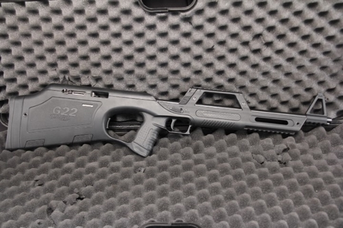
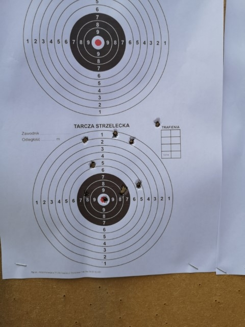

Yesterday, I got my hands on a new, very nice shooting 'toy'.
Walther G22. It sure was fun.

For a guy using this weapon the first time, it was an amazing experience. I used .22 rifles before (CZ 452 especially), tho never in that kind of a format before.

The gun itself feels very comfortable, it may seem a little awkward to hold it since there are that magazine dropping mechanism and the stock itself is a place for magazines (both magazine and a spare one).

This kind of construction gives a very long rifle in its format.
The gun itself is not super heavy, for me, it was comfortable to hold it.
Sights are unusual, but just if you look at them from the side perspective when you actually use the gun, they're fine.

All actions during usage can be done with the left hand. You hold your right index finger near the trigger, while with the left hand you can load and unload magazines using mentioned before mechanism and pull back the lock and just like that you can use your weapon. Comfortable indeed.

.22 ammunition seems to be very cheap, at least here. I buy one round of ammo for 0.3PLN, that's less than 0.1USD. The gun seems easy to use, it's cheap to use it, it's comfortable to use it. It gives what you should look for if you just want to chill out on the shooting range. Pure fun.

